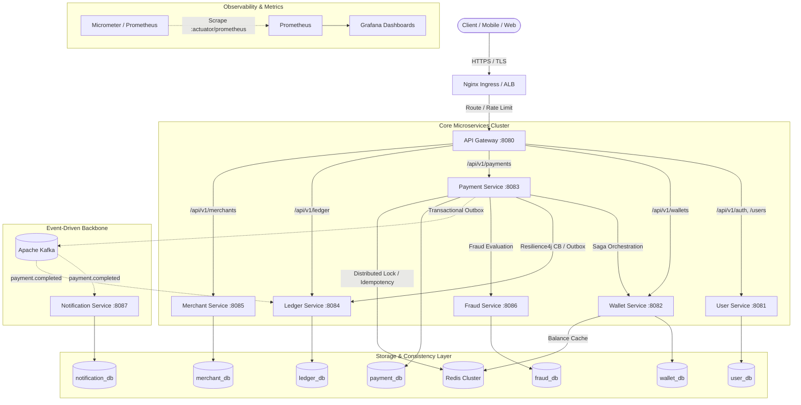

# ⚡ PayFlow — Distributed Payment & Digital Wallet Platform

[](https://openjdk.org/projects/jdk/21/)
[](https://spring.io/projects/spring-boot)
[](https://kafka.apache.org/)
[](https://www.postgresql.org/)
[](https://redis.io/)
[](https://kubernetes.io/)
[-success.svg)](https://github.com/)

**PayFlow** is a production-grade distributed payment and digital wallet platform engineered to the standards of Tier-1 Fintechs (Stripe, Razorpay, Revolut, Block). Built with **Java 21, Spring Boot 3, Apache Kafka, PostgreSQL, Redis, and Kubernetes**, PayFlow demonstrates strict financial consistency, distributed transaction orchestration, zero-drift double-entry accounting, and multi-layer fault tolerance.

---

## 🏛️ System Architecture



---

## ✨ Key Architectural Highlights

### 1. 💳 Financial Consistency & Invariants
- **Minor Unit Accounting (`long amountMinor`):** Eliminates IEEE 754 binary floating-point rounding errors. Monetary values are strictly stored as integer cents/paise (e.g., `$10.50 -> 1050L`).
- **Atomic Conditional SQL Updates:** Prevents race conditions and negative balances without heavy distributed locking:
  ```sql
  UPDATE wallets SET balance_minor = balance_minor - :amount, version = version + 1
  WHERE id = :walletId AND balance_minor >= :amount;
  ```
- **Immutable Double-Entry Ledger:** Every financial movement creates immutable debit and credit journal entries satisfying `SUM(debits) == SUM(credits)`. Zero ledger drift is mathematically enforced.

### 2. 🔄 Distributed Transaction Orchestration (Saga Pattern)
- **Centralized Orchestrator:** Governs payment lifecycle through an explicit state machine (`CREATED → PROCESSING → SUCCESS / FAILED → REFUNDED`).
- **Backward Compensation:** If the credit leg fails after debiting the sender, the orchestrator automatically executes backward compensating transactions (`creditSenderRefund`), returning funds to the sender.
- **Transactional Outbox & Inbox:** Eliminates the dual-write hazard between PostgreSQL and Kafka using atomic outbox polling and deduplicated inbox message processing (`processed_events`).

### 3. 🔒 Idempotency & Fintech Security
- **Two-Tier Idempotency Defense:** Fast-path distributed locking in Redis + composite unique database constraints on `(sender_wallet_id, idempotency_key)` guarantees zero double-debiting under concurrent retries.
- **Merchant API Key Security:** Keys are generated via CSPRNG (`SecureRandom`), prefixed with `pf_live_` for automated secret scanning, and stored **exclusively as SHA-256 hashes**. The raw plaintext key is exposed only once at creation time.
- **Stateless JWT & Refresh Tokens:** RSA/HMAC-SHA256 signed access tokens with SHA-256 hashed refresh token rotation and token family invalidation.

### 4. 🛡️ Resilience & Fault Tolerance
- **Resilience4j Integration:** Circuit breakers, semaphore bulkheads (limiting concurrent downstream requests to 20), and exponential backoff retries protect `payment-service` against downstream degradation in `wallet-service` or payment gateways.
- **Graceful Fallbacks:** Ledger operations fall back to asynchronous Outbox event reconciliation when synchronous calls fail.

### 5. 📊 End-to-End Observability
- **MDC Correlation Tracing:** Propagates `X-Trace-Id` across all HTTP endpoints, asynchronous Kafka events, and logs.
- **Micrometer Business Metrics:** Custom counters and timers with SLA percentiles (p50, p95, p99) for payment throughput, fraud rejection rates, and saga compensation alerts (`payflow_saga_compensation_failed_total > 0`).

---

## 📦 Microservices Breakdown

| Service | Port | Database | Primary Responsibility |
|---|---|---|---|
| **`api-gateway`** | 8080 | — | Spring Cloud Gateway, route forwarding, rate-limiting, CORS |
| **`user-service`** | 8081 | `user_db` | User registration, BCrypt authentication, JWT token rotation |
| **`wallet-service`** | 8082 | `wallet_db` | Wallet balance management, atomic conditional debits/credits |
| **`payment-service`** | 8083 | `payment_db` | Saga orchestrator, idempotency engine, transactional outbox |
| **`ledger-service`** | 8084 | `ledger_db` | Double-entry journal entries, immutable transaction history |
| **`merchant-service`**| 8085 | `merchant_db` | Merchant onboarding, scoped SHA-256 API key security |
| **`fraud-service`** | 8086 | `fraud_db` | Sliding-window velocity tracking, blacklist rule chain (SPI) |
| **`notification-service`**| 8087 | `notification_db` | Event-driven Kafka listener, Email/SMS/Push strategy pattern |

---

## 🚀 Getting Started

### Prerequisites
- **JDK 21**
- **Maven 3.9+**
- **Docker & Docker Compose**

### 1. Build and Run Tests
```bash
# Set JDK 21 environment
export JAVA_HOME="/path/to/jdk-21"

# Compile reactor and execute all 98 unit/integration tests
mvn clean verify
```

### 2. Launch with Docker Compose
```bash
# Start all 8 microservices, PostgreSQL, Kafka, Redis, Prometheus, and Grafana
docker compose --env-file .env up -d --build

# Verify running services
docker compose ps

# Tail logs for payment service
docker compose logs -f payment-service
```

### 3. Deploy to Kubernetes (Helm)
```bash
# Deploy all workloads to Kubernetes namespace 'payflow'
helm upgrade --install payflow ./k8s/helm/payflow \
  --namespace payflow \
  --create-namespace \
  --values ./k8s/helm/payflow/values.yaml
```

---

## 🧪 Performance & Stress Testing

Simulate 1,000 TPS concurrent payment traffic and test idempotency spike safety using **K6**:

```bash
# 1,000 TPS Concurrent Payment Load Test
k6 run performance/k6/concurrent_transfers.js

# 50-VU Concurrent Idempotency Spike Test (Verifies zero double-debiting)
k6 run performance/k6/idempotency_spike.js
```

---

## 📚 Documentation & Interview Guide
- 📖 [Staff/Senior Engineer Interview Preparation Guide](docs/INTERVIEW_GUIDE.md) — Deep-dive architectural Q&A, trade-off analyses, and system design answers.
- 📡 [REST API & OpenAPI Specification](docs/API_DOCUMENTATION.md) — Complete endpoint reference with request/response samples for all 8 microservices.
- 🏛️ [System Design & FSM Blueprint](docs/SYSTEM_DESIGN.md) — CloudEvents Kafka schemas, FSM matrices, and Saga sequence diagrams.
- 🚨 [SRE Production Runbook](docs/RUNBOOK.md) — Incident triage guide, PromQL alerting rules, and operational disaster recovery commands.
- 📄 [Resume Optimization Bullets](docs/RESUME_BULLETS.md) — Quantified, high-impact resume bullet points tailored for fintech and distributed systems roles.
- 🏗️ [AWS Production Terraform IaC](terraform/main.tf) — Multi-AZ VPC, EKS, Aurora PostgreSQL, ElastiCache Redis, and Amazon MSK.
- ⚙️ [CI/CD Pipeline](.github/workflows/ci-cd.yml) — GitHub Actions workflow with matrix container builds and Trivy security auditing.

---

## 📄 License
This project is licensed under the MIT License.
