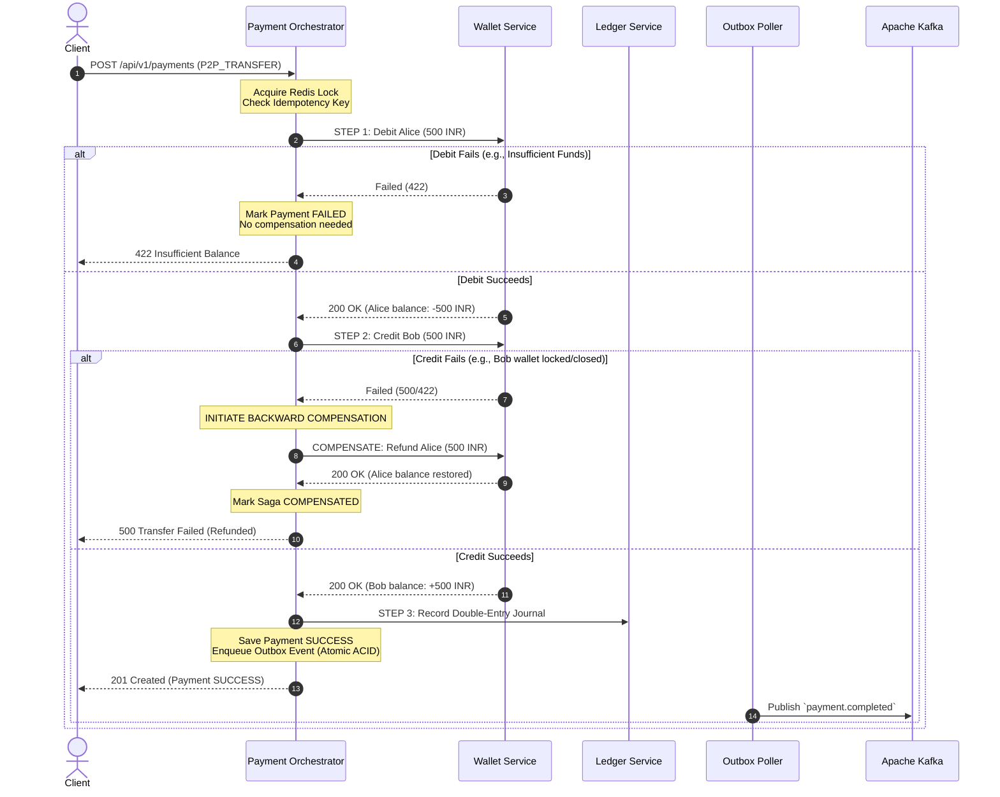

# PayFlow — Production Architecture Blueprint & System Design

This document details the low-level architectural blueprints, finite state machine transitions, event schemas, and failure recovery matrices for the PayFlow platform.

---

## 1. Domain Event & Message Schemas (Apache Kafka)

All inter-service asynchronous communication uses structured CloudEvents-compliant `DomainEvent<T>` envelopes.

### 1.1 Event Envelope Structure
```json
{
  "eventId": "a1b2c3d4-e5f6-7a8b-9c0d-1e2f3a4b5c6d",
  "eventType": "PaymentCompleted",
  "aggregateType": "Payment",
  "aggregateId": "98765432-1234-5678-9abc-def012345678",
  "timestamp": "2026-08-31T01:05:00.123456Z",
  "version": 1,
  "payload": { ... },
  "metadata": {
    "traceId": "4f8e2cdaf442ca63",
    "source": "payment-service"
  }
}
```

### 1.2 Event Catalog

| Topic | Event Type | Producer | Consumers | Key / Partitioning |
|---|---|---|---|---|
| `payment.initiated` | `PaymentInitiated` | `payment-service` | `fraud-service` | `senderWalletId` |
| `payment.completed` | `PaymentCompleted` | `payment-service` | `ledger-service`, `notification-service` | `senderWalletId` |
| `payment.failed` | `PaymentFailed` | `payment-service` | `notification-service` | `senderWalletId` |
| `wallet.debited` | `WalletDebited` | `wallet-service` | `ledger-service` | `walletId` |
| `wallet.credited` | `WalletCredited` | `wallet-service` | `ledger-service` | `walletId` |

---

## 2. Finite State Machine (FSM) Transition Matrices

### 2.1 Payment Lifecycle FSM (`PaymentStatus`)

```
   [START]
      │
      ▼
   CREATED ──────► CANCELLED (via client abort)
      │
      ▼
  PROCESSING ────► FAILED (gateway reject, fraud block, or insufficient funds)
      │
      ▼
   SUCCESS ──────► REFUND_PENDING ────► REFUNDED
```

| Source State | Target State | Triggering Action | Allowed? |
|---|---|---|---|
| `CREATED` | `PROCESSING` | Payment execution initiated | ✅ |
| `CREATED` | `CANCELLED` | Explicit cancellation before processing | ✅ |
| `PROCESSING` | `SUCCESS` | Gateway/transfer authorization succeeded | ✅ |
| `PROCESSING` | `FAILED` | Gateway decline, fraud trigger, or timeout | ✅ |
| `SUCCESS` | `REFUND_PENDING` | Refund request received | ✅ |
| `REFUND_PENDING`| `REFUNDED` | Refund credited back to sender | ✅ |
| `FAILED` | `SUCCESS` | Any transition from terminal state | ❌ (`InvalidStateTransitionException`) |
| `REFUNDED` | `SUCCESS` | Any transition from terminal state | ❌ (`InvalidStateTransitionException`) |

---

## 3. Saga Orchestration & Backward Compensation Matrix

When executing a P2P transfer between two wallets (`Alice -> Bob: 500 INR`):



---

## 4. Failure Modes & Recovery Matrix

| Failure Scenario | System Impact | Mitigation / Automated Recovery |
|---|---|---|
| **Redis Node Outage during lock acquisition** | Idempotency lock cannot be acquired | Fallback to PostgreSQL composite unique constraint `(sender_wallet_id, idempotency_key)` |
| **Kafka Broker Down during payment commit** | Outbox event cannot be published immediately | Event is persisted in `outbox_events` table within DB transaction. `OutboxPoller` retries publication with exponential backoff on broker recovery |
| **Payment Service JVM Crash mid-Saga** | Payment left in `PROCESSING` state | Scheduled `SagaReconciliationJob` identifies stale payments (>5 min in `PROCESSING`), inspects wallet journal entries, and resolves to `SUCCESS` or executes refund |
| **Duplicate Webhook / Kafka Delivery** | Potential duplicate channel send or ledger entry | Consumer inbox table (`processed_events`) with composite key `(event_id, consumer_name)` rejects duplicates |
| **Slow Ledger Service** | Threat of thread pool exhaustion | Resilience4j Semaphore Bulkhead caps concurrent ledger calls to 15; Circuit Breaker opens after 60% failure |
